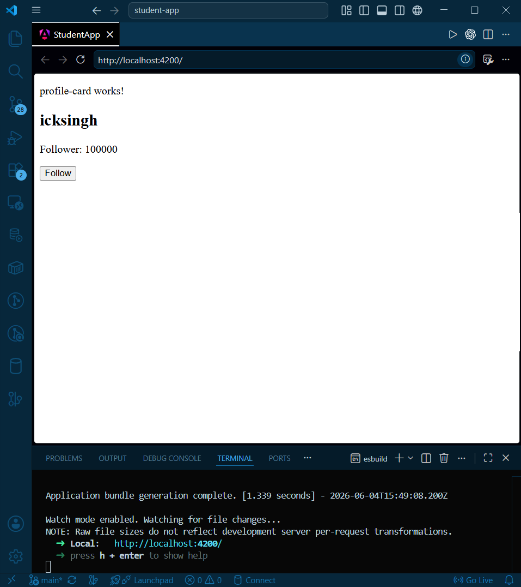

```
# StudentApp

This project was generated using [Angular CLI](https://github.com/angular/angular-cli) version 21.2.13.
```

In this project we implement a custom componennt named "user-profile" and display user's follower count and provide a button to follow user. Implement the button with a increment method.


## Steps:
    1. ng new student-app

    2. ng g c user-profile

    3. Navigate to "./src/app/app.ts" and remove statement that imports 'RouterOutlet' from '@angular/router' and remove 'RouterOutlet' from "imports' under '@Component'.

    4. Navigate to "./src/app/app.html" and remove everything. Replace it with the selector name specified in "./src/app/profile-card/profile-card.ts" under '@Component'

    5. In "./src/app/profile-card/profile-card.ts", write the logic for user inside 'export class ProfileCard()'.

    6. Open file "./src/app/profile-card/profile-card.html" and write the HTML structure you want to display in browser.

    7. ng serve

    8. Click the link to see the preview.


### Preview:



[Assignment link](https://docs.google.com/document/d/e/2PACX-1vSSU0zKA1HiST5wl1yoQuYGSW-5EsiRi6b07YoSt3GVRX4TjJWPOjk5EVDhBivCvlCdiw7Mn9luNkKg/pub)